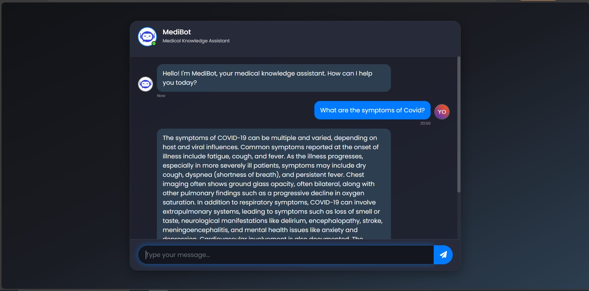

# 🤖 Medical AI Agent

This project contains a web-based medical chatbot application that utilizes NLP models to provide medical information based on the CORD-19 dataset.

## Project Description
### Phase-1
This project analyzes COVID-19 research literature with a focus on two key risk factors: *smoking* and *obesity*. Our team collaborated to build a semantic search system that identifies and processes relevant scientific papers from the CORD-19 dataset, creating a specialized knowledge base for these specific comorbidities.
1. **Data Acquisition**
- Source: [CORD-19 dataset from Hugging Face](https://huggingface.co/datasets/allenai/cord19)
- Configurations: We exclusively used the `fulltext` configuration which contains complete article texts
2. **Semantic Filtering Process**
- We implemented a sophisticated keyword expansion and semantic search pipeline. Final vocabulary: 27 unique terms covering both topics.
   <span style="background-color:rgba(172, 172, 57, 0.93); color: white; font-weight: bold;">Keyword Expansion</span>
   - Seed terms: 
     - Smoking: ["smoke", "smoking", "tobacco", "nicotine", "cigarette"]
     - Obesity: ["obesity", "overweight", "adiposity"]
   - Expanded to include:
     - Medical terminology variations
     - Grammatical forms
     - Common compound forms
     - Clinical synonyms
3. **Semantic Search Engine Implementation**
- At the core of our document filtering system is a powerful semantic search engine powered by SentenceTransformers' `all-mpnet-base-v2` model
- The model creates rich 768-dimensional vector representations that effectively capture the nuanced relationships between medical concepts in our documents
- To ensure the highest relevance of selected documents, we implemented a multi-stage validation process. The system first performs an initial semantic search across the entire corpus, identifying potentially relevant papers and retaining only the **top-k most relevant documents** per query. These candidates then undergo rigorous post-hoc verification, such as:
  - We automatically remove duplicates by comparing DOI identifiers, preventing redundant entries in our final collection
  - We enforce strict quality thresholds - any document with a similarity score below 0.4 gets automatically excluded
4. **Building the Vector Knowledge Base**
- To enable efficient retrieval and analysis of the relevant research papers, we transformed the filtered documents into a specialized vector index. For this purpose we used the `BAAI/bge-large-en` model
- Before ingestion, we processed each document with a SimpleNodeParser, which automatically handles text chunking to maintain optimal context windows while preventing information fragmentation
- The embedded documents were then organized using ChromaDB, a lightweight yet powerful vector store that allows for fast similarity searches
5. **Quality Assessment & Validation**
To ensure the reliability of our semantic search results, we implemented a robust validation framework combining visual analytics and neighbor discovery techniques
- Using UMAP dimensionality reduction, we projected both documents and search terms into a shared 2D space, enabling visual verification that retrieved papers properly cluster around their target keywords
- Through boxplots we examined the distribution of our keywords in the indentified documents
- We performed a quality check (confirming our search didn't miss obvious candidates, aka borderline cases = those documents which were not placed inside our search cluster). This approach gives us confidence that our search parameters aren't excluding semantically relevant research while maintaining precision

### Phase-2
We have built a classifer using `distilbert-base-uncased`, which can classify the articles based on their abstracts into two categories:
   1. Positive Class (Label = 1): Documents identified as relevant through our semantic search (containing covid-smoking-obesity related terms)
   2. Negative Class (Label = 0): Documents not matching our keyword criteria
   
- The classifier achieved robust results, demonstrating strong generalization:
   - **Accuracy:** 93%
   - **Precision:** >90% (minimized false positives)
   - **Recall:** >90% (minimized false negatives)
   - **AUC-ROC:** 0.9824 (near-perfect separability between classes)
- We probed the model’s decision-making by analyzing its *attention layers* —identifying which words most influenced the decision making

### Phase-3
To complement our CORD-19 dataset, we systematically acquired open-access COVID-19 research focusing on smoking and obesity comorbidities through PubMed Central's API. Every newly retrieved article underwent a rigorous process before being added to our knowledge base:
   - Our "Phase 2" DistilBERT classifier (93% accurate) evaluated each article's abstract, assigning one of two labels. In case of label 1, our Chroma vector database was expanded with those documents
  
## Phase-4
We created a GUI for the chatbot using basic web development tools such as HTML, CSS, and JavaScript. For the backend, we used Python's Flask library. The app was eventually containerized using Docker. We integrated a large language model (LLM) from OpenAI for question answering (QA). Therefore, if you want to try it out, you will need to obtain an API key.

- Clone the Docker Hub repository and try it out:
   ```
   docker pull regeleardealului/covid_ai_assistant:1.0.0
   docker run -p 5000:5000 -e OPENAI_API_KEY="YOUR_OPENAI_API_KEY" regeleardealului/covid_ai_assistant:1.0.0
   ```
- Here is preview of the GUI: 


## Usage
1. Open the application in your web browser (your localhost)
2. Type your medical related question in the input field
3. Press Enter or click the *Send* button to get a response
4. The chatbot will analyze your question and provide a response based on the created vector database


